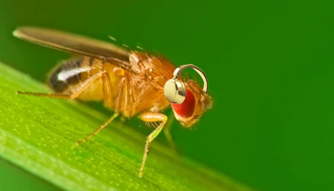

# Drosophila Audio Connectome Simulator

FlyWire Brain Dataset (FAFB v783) from Kaggle where connections.csv and classification.csv are found and needed to run the simulator.
A high-performance neural engine written in C that simulates the biological connectome of a *Drosophila* (fruit fly) reacting to real-time audio.

This engine maps 135,000 neurons and 3.8 million synapses, utilizing a Compressed Sparse Row (CSR) memory architecture to eliminate dynamic allocation bottlenecks and cache misses. Audio frequencies are extracted via the FFTW library, normalized, and injected directly into the biological sensory nodes, triggering mathematically accurate neural cascades of up to 29.5 million firings per tick.

## Key Features

* **Biological Scale:** Simulates a structurally accurate connectome containing 135,000 nodes and 3,869,878 pure biological edges.
* **Bare-Metal Optimization:** Migrated from O(N) linked-list graph traversal to a contiguous 1D array CSR memory layout, allowing the CPU cache to process millions of neuronal state changes in milliseconds.
* **Real-Time DSP:** Integrates FFTW3 to parse `.wav` audio files. Bass frequencies are mapped to the left ear (Node 56806) and treble frequencies to the right ear (Node 60000).
* **Leaky Integrate-and-Fire (LIF):** Implements dynamic biological decay loops and Python-normalized synapse weights to stabilize runaway signal cascades.
* **Emergent Asymmetry:** Mathematically proves the connectome's inherent biological contralateral structure and heavy left-hemisphere dominance.

## Acoustic Benchmarks

Because the biological dataset is heavily structurally biased toward the left hemisphere, injecting bass triggers massive left-wing cascades. High-frequency audio is required to pierce the GABA inhibition on the right sensory node. 

**Hemisphere Activation by Track:**
* **Hotline Miami - *Run* (Heavy Synth Bass):** 1.27 Billion cascade firings. Left Wing: 27,491 | Right Wing: 1,625
* **Toby Fox - *Black Knife* (Chiptune Treble):** 530 Million cascade firings. Left Wing: 11,425 | Right Wing: 4,531
* **Aphex Twin - *Xtal* (Complex High-End Percussion):** 1.26 Billion cascade firings. Left Wing: 27,222 | Right Wing: 11,489 *(Highest right-wing ratio recorded: 0.42)*

## Prerequisites

* **GCC** (or equivalent C compiler)
* **FFTW3 Library** (`libfftw3-dev`)
* **Python 3** and **Pandas** (for the initial synapse parsing/mapping script)

## How to Build and Run

1. **Map the Connectome:**
   Generate the biological edges and normalize the synaptic weights.
   python3 mapper.py

2. **Compile the 'Engine'**
    make

3. **Run the simulation**
    ./fly_simulation sample_audio.wav

Note: In the other README there is an instance in which the fly leans right, that is when a sin x signal is played, therefore we can conclude that the fly leans more to the right the more it sounds like a sin signal, xtal and black knife are two songs that are more similar to the sin signal than the rest of the songs.

   
